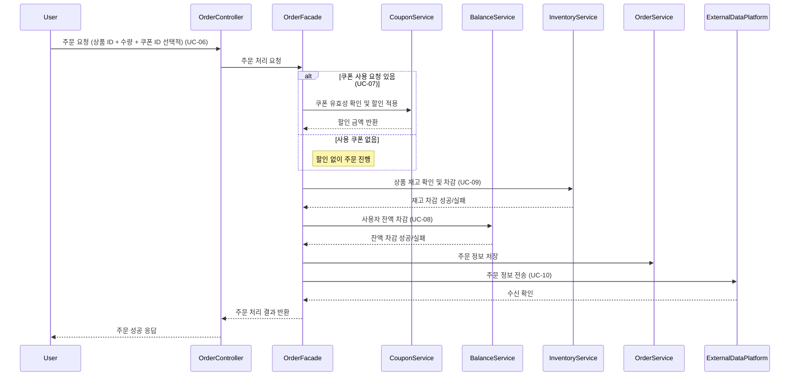
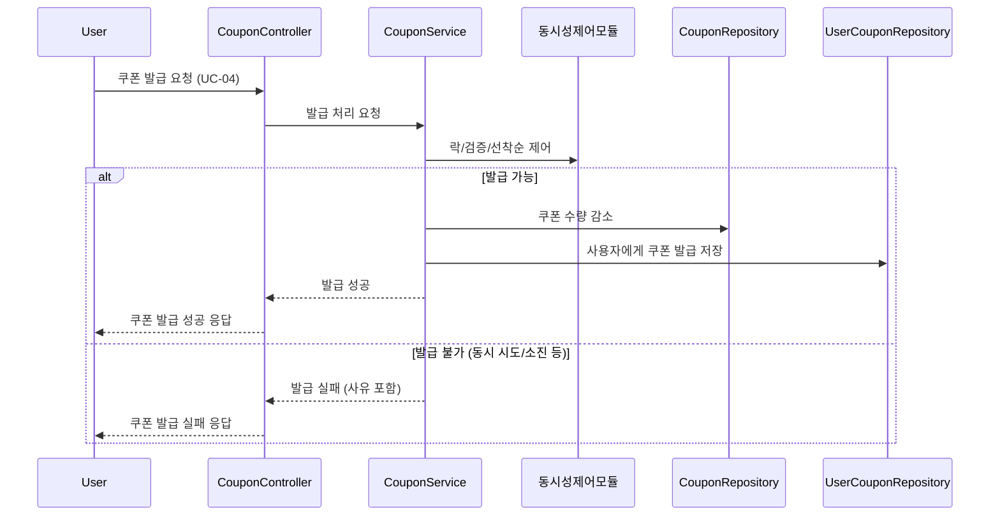
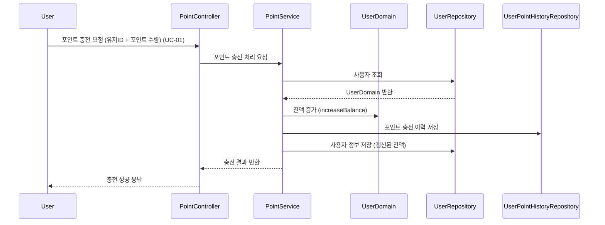

### 목차

- [요구사항 분석](01_requirements.md)
- [시퀀스 다이어그램](02_sequence_diagram.md)
- [ERD](03_entity_relationship_diagram.md)
- [플로우 차트](04_flow_chart.md)
- [상태 다이어그램](05_state_diagram.md)

 

# 시퀀스 다이어그램

## 주문&결제 흐름 시퀀스 다이어그램

> UC-06: 상품 주문 및 결제 ~ UC-10: 주문 내역 외부 전송

1. 사용자가 상품과 수량을 선택해 주문을 요청한다. 쿠폰 ID는 선택적으로 전달된다.
2. 쿠폰이 있다면, 유효성을 확인하고 할인 금액을 계산한다.
3. 재고 서비스가 재고를 확인하고 차감한다.
4. 잔액 서비스가 사용자 잔액을 차감한다.
5. 주문 정보는 DB에 저장된다.
6. 주문 정보가 외부 데이터 플랫폼에 전송된다.
7. 최종 결과가 사용자에게 반환된다.

 
 

## 선착순 쿠폰 발급 시퀀스 다이어그램 (정상 + 예외 흐름 포함)

> UC-04: 선착순 쿠폰 발급

1. 사용자가 쿠폰 발급을 요청한다.
2. 동시성 제어 모듈을 통해 선착순을 제어한다.
3. 쿠폰 발급이 가능하다면, 쿠폰 서비스가 수량을 확인하고 차감한다.
4. 쿠폰 발급 내역은 DB에 저장된다.
5. 쿠폰 발급이 불가능 하다면 (동시 시도, 쿠폰 소진 등), 실패 사유를 포함하여 사용자에게 응답한다.
6. 최종 결과가 사용자에게 반환된다.

 
 

## 포인트 충전 시퀀스 다이어그램

> UC-01: 잔액 충전하기

1. 사용자가 포인트 충전을 요청한다.
2. 포인트 서비스가 사용자를 조회한다.
3. 유저 도메인에서 해당 사용자의 잔액을 증가 시킨다.
4. 포인트 충전 이력은 DB에 저장된다.
5. 사용자의 갱신된 잔액은 DB에 저장된다.
6. 최종 결과가 사용자에게 반환된다.