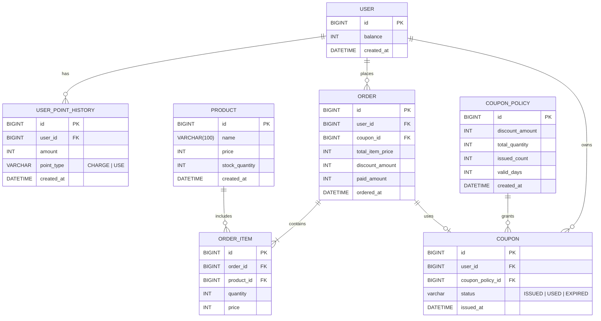

### 목차

- [요구사항 분석](01_requirements.md)
- [시퀀스 다이어그램](02_sequence_diagram.md)
- [ERD](03_entity_relationship_diagram.md)
- [플로우 차트](04_flow_chart.md)
- [상태 다이어그램](05_state_diagram.md)

<br/>

# ERD ( Entity - Relationship Diagram )


## 전체 테이블 구조



<br/>
<br/>

## 테이블 생성 쿼리 (DDL)

```sql
-- 사용자 테이블
CREATE TABLE user (
    id BIGINT PRIMARY KEY AUTO_INCREMENT,
    balance INT NOT NULL DEFAULT 0,
    created_at DATETIME NOT NULL DEFAULT CURRENT_TIMESTAMP
);

-- 사용자 포인트 이력
CREATE TABLE user_point_history (
    id BIGINT PRIMARY KEY AUTO_INCREMENT,
    user_id BIGINT NOT NULL,
    amount INT NOT NULL,
    type ENUM('CHARGE', 'USE') NOT NULL,
    created_at DATETIME NOT NULL DEFAULT CURRENT_TIMESTAMP,
    INDEX idx_user_point_history_user_id (user_id)
);

-- 상품 테이블
CREATE TABLE product (
    id BIGINT PRIMARY KEY AUTO_INCREMENT,
    name VARCHAR(100) NOT NULL,
    price INT NOT NULL,
    stock_quantity INT NOT NULL,
    created_at DATETIME NOT NULL DEFAULT CURRENT_TIMESTAMP
);

-- 쿠폰 정책 테이블
CREATE TABLE coupon_policy (
    id BIGINT PRIMARY KEY AUTO_INCREMENT,
    discount_amount INT NOT NULL,
    total_quantity INT NOT NULL,
    issued_count INT NOT NULL DEFAULT 0,
    valid_days INT NOT NULL,
    created_at DATETIME NOT NULL DEFAULT CURRENT_TIMESTAMP
);

-- 쿠폰 테이블
CREATE TABLE coupon (
    id BIGINT PRIMARY KEY AUTO_INCREMENT,
    user_id BIGINT NOT NULL,
    coupon_policy_id BIGINT NOT NULL,
    status ENUM('ISSUED', 'USED', 'EXPIRED') NOT NULL DEFAULT 'ISSUED',
    issued_at DATETIME NOT NULL DEFAULT CURRENT_TIMESTAMP,
    UNIQUE INDEX uniq_user_coupon (user_id, coupon_policy_id), -- 한 유저당 쿠폰 1회만 발급
    INDEX idx_coupon_user_id (user_id)
);

-- 주문 테이블
CREATE TABLE `order` (
    id BIGINT PRIMARY KEY AUTO_INCREMENT,
    user_id BIGINT NOT NULL,
    coupon_id BIGINT NULL,
    total_item_price INT NOT NULL,
    discount_amount INT NOT NULL DEFAULT 0,
    paid_amount INT NOT NULL,
    ordered_at DATETIME NOT NULL DEFAULT CURRENT_TIMESTAMP,
    INDEX idx_order_user_id (user_id),
    INDEX idx_order_coupon_id (coupon_id),
    INDEX idx_order_ordered_at (ordered_at) -- 상위 상품 조회 대비
);

-- 주문 항목 테이블
CREATE TABLE order_item (
    id BIGINT PRIMARY KEY AUTO_INCREMENT,
    order_id BIGINT NOT NULL,
    product_id BIGINT NOT NULL,
    quantity INT NOT NULL,
    unit_price INT NOT NULL,
    price INT NOT NULL,
    INDEX idx_order_item_order_id (order_id),
    INDEX idx_order_item_product_id (product_id)
);
```