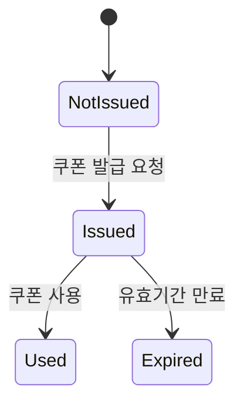

### 목차

- [요구사항 분석](01_requirements.md)
- [시퀀스 다이어그램](02_sequence_diagram.md)
- [ERD](03_entity_relationship_diagram.md)
- [플로우 차트](04_flow_chart.md)
- [상태 다이어그램](05_state_diagram.md)

 

# 상태 다이어그램

## 쿠폰 상태 다이어그램

