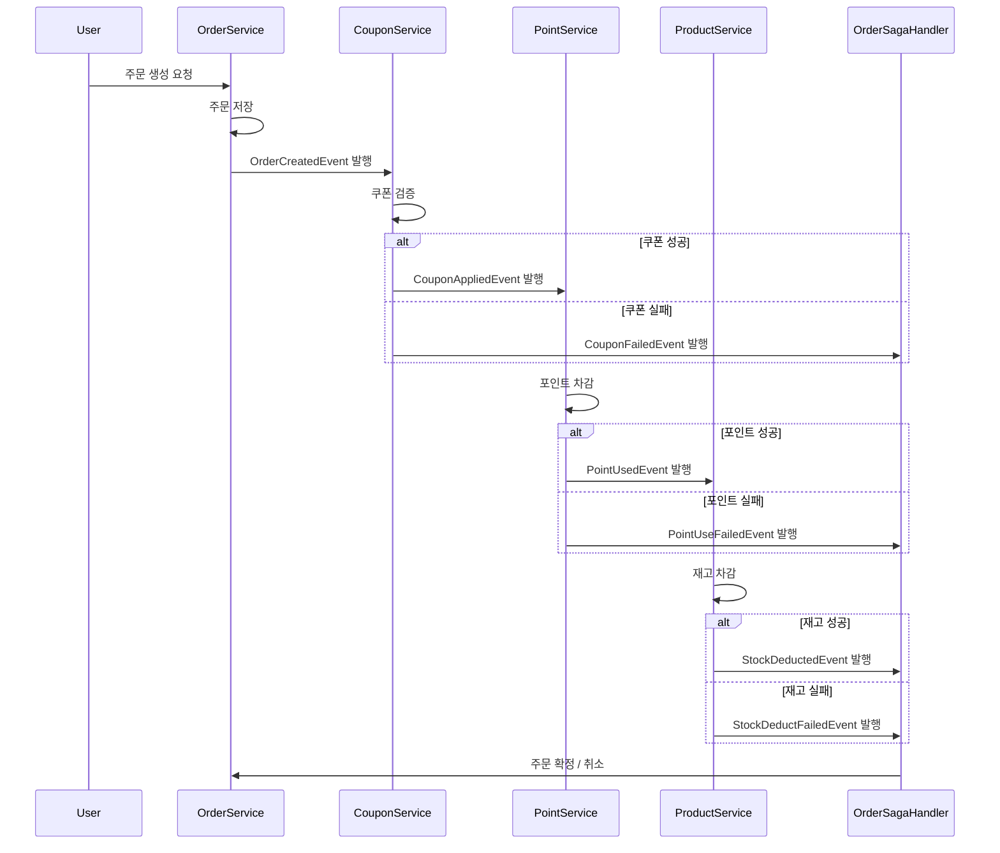

# 분산 환경의 트랜잭션 설계

서비스의 확장에 따라 어플리케이션 서버와 DB를 도메인별로 분리했을때, 트랜잭션 처리의 한계와 대응 방안을 제시합니다.


<br/>

## 📚 목차

- [1. 배경](#1-배경)
- [2. 트랜잭션 분리의 배경](#2-트랜잭션-분리의-배경)
- [3. 도메인별 트랜잭션 분리 시 발생 가능한 문제](#3-도메인별-트랜잭션-분리-시-발생-가능한-문제)
- [4. 분산 트랜잭션 설계 원칙](#4-분산-트랜잭션-설계-원칙)
- [5. 대응 방안](#5-대응-방안)
- [6. 도메인 분리 및 이벤트 기반 트랜잭션 분리 구현 예제](#6-도메인-분리-및-이벤트-기반-트랜잭션-분리-구현-예제)
- [7. 결론](#7-결론)

<br/>

<br/>

## 1. 배경

서비스의 확장과 함께 **어플리케이션 서버와 DB를 도메인별로 분리**하면, 기존의 단일 DB 환경에서는 고려하지 않았던 **트랜잭션 처리의 한계**가 발생한다.
본 문서는 이러한 한계를 진단하고, **트랜잭션 분리로 발생할 수 있는 문제를 식별**하여, **분산 환경에서도 데이터 일관성을 보장하는 설계 방안**을 제시한다.


<br/>

<br/>

## 2. 트랜잭션 분리의 배경

### 기존 구조 (Monolithic + 단일 DB)

- 하나의 DB와 하나의 트랜잭션 경계
- ACID 트랜잭션 보장 → 개발은 단순하지만 확장성, 성능 한계 존재

### 개선 구조 (Domain 별 DB 분리)

- 도메인 별로 **서버와 DB 분리** (예: 주문, 결제, 재고, 회원)
- 서비스 간 **독립 배포/확장 가능**
- 하지만 **트랜잭션이 분산**되면서 일관성 보장 문제가 발생


<br/>

<br/>


## 3. 도메인별 트랜잭션 분리 시 발생 가능한 문제

1. **원자성(Atomicity) 깨짐**
    - 주문은 생성되었으나 결제/재고 차감 실패 → 데이터 불일치 발생
2. **중복 처리(Idempotency) 문제**
    - 네트워크 지연/장애로 이벤트 중복 발행 시 결제·재고가 이중 처리될 수 있음
3. **순서 보장 문제**
    - 이벤트 기반 처리 시 메시지 순서가 보장되지 않으면 **결제 취소 이벤트**가 **결제 성공 이벤트**보다 먼저 도착하는 문제 발생
4. **데이터 정합성 저하**
    - 최종적 일관성을 허용하면 특정 시점에서 사용자에게 보이는 데이터가 일치하지 않을 수 있음
5. **보상 트랜잭션 복잡성**
    - 이미 성공한 단계를 되돌리는 보상 트랜잭션은 비즈니스 정책에 따라 구현 난이도가 높음

<br/>

<br/>

## 4. 분산 트랜잭션 설계 원칙

1. **서비스 경계 내 트랜잭션(Local Transaction)만 보장**
    - 각 서비스는 자기 DB에만 책임
2. **최종적 일관성(Eventual Consistency)** 수용
    - 강한 일관성(Strong Consistency) 대신 도메인 정책에 따라 허용 가능한 지연
3. **SAGA 패턴 적용 (Choreography / Orchestration)**
    - 이벤트 기반 보상 트랜잭션으로 원자성 보완
4. **Idempotency 보장**
    - 동일 이벤트가 여러 번 처리돼도 결과가 변하지 않도록 설계
    - 예: `processed_event` 테이블로 중복 이벤트 차단
5. **Outbox Pattern & 메시지 브로커**
    - 트랜잭션과 이벤트 발행을 원자적으로 묶어 **이벤트 유실 방지**
6. **Retry & Dead Letter Queue**
    - 실패 이벤트는 재시도
    - 일정 횟수 이상 실패 시 DLQ로 보내 후속 처리
7. **Observability (모니터링/추적)**
    - 분산 환경에서는 로그만으로 문제 추적 어려움
      → Distributed Tracing (Zipkin, OpenTelemetry), 이벤트 모니터링 대시보드 필요

<br/>

<br/>

## 5. 대응 방안

### 5.1 SAGA 패턴

- **로컬 트랜잭션 + 보상 트랜잭션**으로 분산 트랜잭션 문제 해결
- 각 서비스는 자신의 DB에서만 트랜잭션을 관리
- 실패 시 이전 단계에 대한 **보상 로직(Compensation)** 실행

```
ex) 주문 생성 프로세스

1. 주문 서비스 → 주문 생성
2. 결제 서비스 → 결제 승인
3. 재고 서비스 → 재고 차감

- 결제 실패 시: 주문 취소(보상 트랜잭션)
- 재고 차감 실패 시: 결제 취소 + 주문 취소
```

<br/>

### 5.2 메시징 전략 (Event-driven)

- **Kafka, RabbitMQ** 등 메시지 브로커 활용
- 서비스 간 통신을 이벤트 기반으로 처리하여 **비동기 트랜잭션** 보장
- **Outbox Pattern** 활용 → DB와 메시지 발행의 원자성 확보

<br/>

### 5.3 최종적 일관성 (Eventual Consistency)

- 강력한 즉시 일관성(Strong Consistency)이 아닌, **시간차를 둔 일관성** 허용
- 사용자 경험에 영향이 없는 수준에서 Trade-off

<br/>

### 5.4 설계 방안 요약

문제 유형 | 대응 방안
-- | --
원자성 깨짐 | SAGA 패턴 (보상 트랜잭션)
중복 처리 | Idempotency (이벤트 처리 이력 저장)
순서 불일치 | 메시지 브로커의 파티션 단위 순서 보장, 이벤트 버전 관리
이벤트 유실 | Outbox Pattern + 메시지 브로커
재시도 불가 | Retry 정책 + Dead Letter Queue
모니터링 부재 | Distributed Tracing, 이벤트 상태 추적 테이블


<br/>

<br/>

## 6. 도메인 분리 및 이벤트 기반 트랜잭션 분리 구현 예제

### 6.1 기존 구조 (Facade 기반)

- `OrderFacade` 에서 `CouponService`, `PointService`, `ProductService` 등을 직접 호출
- 강한 결합(의존) → 도메인 확장 시 Facade 코드 변경 불가피


<br/>

### 6.2 개선 구조 (ApplicationEvent 기반)

- 각 서비스는 **자신의 DB 트랜잭션만 관리 (Local Transaction)**
- 서비스 간 통신은 **ApplicationEvent** 로 처리 (Event-driven Choreography)
- 실패 발생 시 **보상 트랜잭션 이벤트**를 발행




**ex) 주문 서비스 이벤트 발행**

```java
@Service
@RequiredArgsConstructor
public class OrderService {
    private final ApplicationEventPublisher eventPublisher;
    private final OrderRepository orderRepository;

    @Transactional
    public Order createOrder(OrderCommand.Create command, List<OrderItem> items) {
        Order order = new Order(command.userId(), items, OrderStatus.PENDING);
        orderRepository.save(order);

        // 주문 생성 이벤트 발행
        eventPublisher.publishEvent(new OrderCreatedEvent(order.getId(), order.getUserId(), order.getPaidAmount(), items));
        return order;
    }
}
```

**ex) 재고 이벤트 리스너**

```java
@Service
@RequiredArgsConstructor
public class ProductEventHandler {
    private final ProductService productService;
    private final ApplicationEventPublisher eventPublisher;

    @TransactionalEventListener(phase = TransactionPhase.AFTER_COMMIT)
    @Transactional(propagation = Propagation.REQUIRES_NEW)
    public void handle(OrderCreatedEvent event) {
        try {
            productService.deductStock(event.getOrderId());
            eventPublisher.publishEvent(new StockDeductedEvent(event.getOrderId()));
        } catch (Exception e) {
            eventPublisher.publishEvent(new StockDeductFailedEvent(event.getOrderId(), e.getMessage()));
        }
    }

    @TransactionalEventListener(phase = TransactionPhase.AFTER_COMMIT)
    public void handleCompensation(StockDeductFailedEvent event) {
        eventPublisher.publishEvent(new PointRefundedEvent(event.getOrderId()));
    }
}

```


<br/>

### 6.3 Spring ApplicationEvent 기반 한계

- **동일 JVM 내에서만 이벤트 전달 가능** → MSA 간 이벤트 전달 불가
- **장애 전파**: 한 서비스 장애가 전체 트랜잭션 보장에 영향을 미침
- **메시지 유실 위험**: 트랜잭션과 이벤트 발행의 원자성 보장 어려움

<br/>

### 6.4 메시지 브로커 기반 확장 필요성

> Kafka/RabbitMQ 등 메시지 브로커를 활용

- **서비스 간 비동기 이벤트 전달**
- **Outbox Pattern으로 이벤트 유실 방지**
- **재시도 / DLQ / 순서 보장 지원**
- **장애 격리 가능** (하나의 서비스 장애가 전체 시스템에 영향을 주지 않음)

<br/>

<br/>

## 7. 결론

- 서비스 확장을 위해 **도메인 단위 DB 분리**는 필수적이지만, 이에 따른 **트랜잭션 분리 문제**를 반드시 고려해야 한다.
- 이를 해결하기 위해 **SAGA 패턴 + 메시지 브로커 기반 이벤트 처리 + 보상 트랜잭션 설계**를 적용할 수 있다.
- **Spring ApplicationEvent**를 활용하면 서비스 간 의존을 줄일 수 있으나, **실제 MSA 확장에는 메시지 브로커 기반 이벤트 아키텍처**가 필수적이다
- 추가적으로 **Idempotency / Outbox Pattern / Retry & DLQ / Observability**를 적용해야 **비즈니스 무결성과 데이터 일관성**을 보장할 수 있다