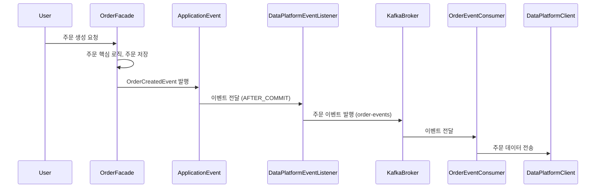

# 대량의 트래픽을 처리를 위한, 카프카(Kafka)

카프카에 대한 기초 개념을 학습하고 기본적인 기능을 실습한 후, 실제 애플리케이션 서비스에 적용해봅니다.


<br/>

## 📚 목차

- [1. 카프카란 무엇인가?](#1-카프카란-무엇인가?)
- [2. 카프카의 구성 요소](#2-카프카의-구성-요소)
- [3. 메시지 전달 보장 방식](#3-메시지-전달-보장-방식)
- [4. 로컬 환경에서 기본 실습](#4-로컬-환경에서-기본-실습)
- [5. 실시간 주문정보 카프카 연동](#5-실시간-주문정보-카프카-연동)
- [6. 카프카 도입 효과](#6-카프카-도입-효과)
- [7. 결론](#7-결론)

<br/>

<br/>

## 1. 카프카란 무엇인가?

Kafka는 **분산 스트리밍 플랫폼**으로, 실시간으로 대용량 데이터를 안전하고 빠르게 전송·저장·처리할 수 있는 메시징 시스템이다.
전통적인 메시징 큐(RabbitMQ 등)와 달리 **높은 처리량**, **분산 아키텍처**, **파티션 기반 확장성** 덕분에 대규모 서비스에서 널리 사용된다.

### 1.1 카프카의 특징
- Pub/Sub 모델 기반의 비동기 메시징
- 높은 처리량과 낮은 지연 시간
- 파티션(Partition)을 통한 수평 확장 및 순서 보장
- Consumer Group을 통한 병렬 처리 및 부하 분산
- 디스크에 로그 저장 → 장애 발생 시에도 내구성 보장

### 1.2 왜 대규모 서비스에서 사용하는가?
- 주문, 결제, 알림 등 수많은 이벤트를 안정적으로 비동기 처리 가능
- 다운스트림 시스템(데이터 플랫폼, 알림 서비스 등)으로 확장 용이
- 마이크로서비스 간 의존도를 낮춰 시스템 복원력 확보

<br/>

<br/>

## 2. 카프카의 구성 요소

- **Broker** : Kafka 서버 프로세스. 여러 대의 Broker가 모여 클러스터 구성
- **Topic** : 메시지를 저장하는 논리적 단위(스트림)
- **Partition** : Topic을 나눈 단위, 같은 키는 항상 같은 파티션에 저장되어 순서 보장
- **Producer** : 메시지를 발행하는 주체
- **Consumer** : 메시지를 구독하는 주체
- **Consumer Group** : 같은 그룹의 Consumer들은 파티션을 나눠 가져가 병렬 처리, 다른 그룹이면 동일 메시지를 각각 소비

<br/>

<br/>


## 3. 메시지 전달 보장 방식

- **At most once** : 최대 한 번 전달 (유실 가능, 중복 없음)
- **At least once** : 최소 한 번 전달 (중복 가능, 유실 없음 → 실무 기본)
- **Exactly once** : 정확히 한 번 전달 (Kafka 트랜잭션 기능 필요, 복잡도↑)

<br/>

<br/>

## 4. 로컬 환경에서 기본 실습

### 4.1 Docker Compose 설정

KRaft 모드 기반 단일 노드 Kafka 실행

```yaml
services:
  kafka:
    image: bitnami/kafka:latest
    container_name: kafka
    ports:
      - "9092:9092"
    environment:
      - KAFKA_ENABLE_KRAFT=yes
      - KAFKA_CFG_NODE_ID=1
      - KAFKA_CFG_PROCESS_ROLES=broker,controller
      - KAFKA_CFG_CONTROLLER_LISTENER_NAMES=CONTROLLER
      - KAFKA_CFG_LISTENER_SECURITY_PROTOCOL_MAP=CONTROLLER:PLAINTEXT,PLAINTEXT:PLAINTEXT
      - KAFKA_CFG_LISTENERS=PLAINTEXT://:9092,CONTROLLER://:9093
      - KAFKA_CFG_ADVERTISED_LISTENERS=PLAINTEXT://localhost:9092
      - KAFKA_CFG_CONTROLLER_QUORUM_VOTERS=1@kafka:9093
      - ALLOW_PLAINTEXT_LISTENER=yes
    volumes:
      - kafka_data:/bitnami/kafka
volumes:
  kafka_data:
```

---

### 4.2 토픽 생성

```bash
# 주문 이벤트 토픽 생성
docker compose exec kafka kafka-topics.sh \
  --bootstrap-server localhost:9092 \
  --create --topic order-events --partitions 3 --replication-factor 1
```

---

### 4.3 메시지 발행 & 소비

```bash
# Consumer 실행
docker compose exec -it kafka kafka-console-consumer.sh \
  --bootstrap-server localhost:9092 \
  --topic order-events \
  --group cg-order \
  --from-beginning
```

```bash
# Producer 실행
docker compose exec -it kafka kafka-console-producer.sh \
  --bootstrap-server localhost:9092 \
  --topic order-events
> hello-1
> hello-2
> {"orderId":1001,"status":"CREATED"}
```

→ Consumer 터미널에 발행한 메시지가 출력됨을 확인

---

### 4.4 키 기반 파티셔닝

```bash
docker compose exec -it kafka kafka-console-producer.sh \
  --bootstrap-server localhost:9092 \
  --topic order-events \
  --property "parse.key=true" \
  --property "key.separator=:"

> u1:order-1
> u2:order-2
> u1:order-3
```

→ 동일한 키(`u1`)는 같은 파티션에 저장되어 **순서성 보장**됨

---

### 4.5 Consumer Group 테스트

- 같은 그룹(`cg-order`)에서 2개 컨슈머 실행 → 파티션 분할 처리
- 다른 그룹(`cg-analytics`)에서 실행 → 동일 메시지를 각각 수신(팬아웃)

```bash
docker compose exec kafka kafka-consumer-groups.sh \
  --bootstrap-server localhost:9092 \
  --describe --group cg-order
```

<br/>

<br/>

## 5. 실시간 주문정보 카프카 연동

- 주문 완료 후 Kafka 메시지로 실시간 주문 정보를 발행
- Spring Boot 애플리케이션에서 Kafka Producer/Consumer 연동 실습
- 주문 데이터 플랫폼 전송을 안전하게 처리

---

### 5.1 핵심 로직: OrderFacade

```java
@Transactional
public void createOrder(OrderCommand.Create command) {
    // 1. 재고 확인
    // ...

    // 2. Order 최소 정보 생성 (PENDING 상태)
    Order order = this.createOrder(command, products);

    // 3. 쿠폰 유효성 검증 및 할인 금액 계산
    // ...

    // 4. 주문 저장 (PENDING)
    this.save(order);

    // 하나의 이벤트만 발행 (Application Event)
    eventPublisher.publishEvent(new OrderCreatedEvent(order));
}
```

- 주문 생성 후 `OrderCreatedEvent`를 Application Event로 발행
- 트랜잭션 커밋 이후 이벤트 발행 → 핵심 데이터 정합성 보장

---

### 5.2 Kafka 메시지 발행: OrderEventProducer

```java
@Service
@RequiredArgsConstructor
@Slf4j
public class OrderEventProducer {

    private final KafkaTemplate<String, String> kafkaTemplate;
    private final ObjectMapper objectMapper;
    private static final String TOPIC = "order-events";

    public void publish(OrderCreatedEvent event) {
        try {
            String message = objectMapper.writeValueAsString(event);
            kafkaTemplate.send(TOPIC, String.valueOf(event.orderId()), message);
            log.info("주문 이벤트 발행 완료: {}", message);
        } catch (JsonProcessingException e) {
            log.error("주문 이벤트 직렬화 실패, orderId={}", event.orderId(), e);
        }
    }
}
```

- ObjectMapper로 이벤트를 JSON으로 직렬화
- KafkaTemplate을 사용해 `order-events` 토픽에 메시지 발행

---

### 5.3 트랜잭션 후 이벤트 전송: DataPlatformEventListener

```java
@Slf4j
@Component
@RequiredArgsConstructor
public class DataPlatformEventListener {

    private final OrderEventProducer orderEventProducer;

    @Async
    @TransactionalEventListener(phase = TransactionPhase.AFTER_COMMIT)
    public void handle(OrderCreatedEvent event) {
        try {
            orderEventProducer.publish(event);
        } catch (Exception e) {
            log.error("주문 데이터 전송 실패, orderId={}", event.orderId(), e);
        }
    }
}
```

- 트랜잭션 커밋 후 Kafka 메시지 발행
- 비동기 처리로 주문 서비스 처리 지연 최소화

---

### 5.4 Kafka 메시지 소비: OrderEventConsumer

```java
@Service
@RequiredArgsConstructor
@Slf4j
public class OrderEventConsumer {

    private final DataPlatformClient dataPlatformClient;
    private final ObjectMapper objectMapper;

    @KafkaListener(topics = "order-events", groupId = "data-platform")
    public void consume(String message) {
        try {
            OrderCreatedEvent event = objectMapper.readValue(message, OrderCreatedEvent.class);
            dataPlatformClient.sendOrderData(event);
        } catch (Exception e) {
            log.error("주문 데이터 전송 실패, message={}", message, e);
        }
    }
}
```

- Kafka 토픽 `order-events` 구독
- 이벤트 수신 후 Data Platform에 주문 데이터 전송

---

### 5.5 시퀀스 다이어그램



<br/>

<br/>

## 6. 카프카 도입 효과

- 주문 처리와 데이터 플랫폼 전송을 비동기 분리 → 주문 서비스 응답 지연 최소화
- Producer/Consumer 구조 → 시스템 확장성 향상, 다른 다운스트림 서비스 추가 용이
- Partition/Consumer Group 활용 → 대용량 트래픽도 병렬 처리 가능
- 순서 보장, 메시지 재처리, 장애 복원력 확보

<br/>

<br/>

## 7. 결론

- Kafka를 통해 **주문 이벤트의 안정적 전송** 보장
- MSA 아키텍처에서 **서비스 간 결합도 감소**
- **대용량 트래픽 처리 가능**, 확장성 및 유연성 확보
- 필요 시 **Outbox/Dead-letter Queue 전략**과 결합하면 메시지 신뢰성 극대화 가능