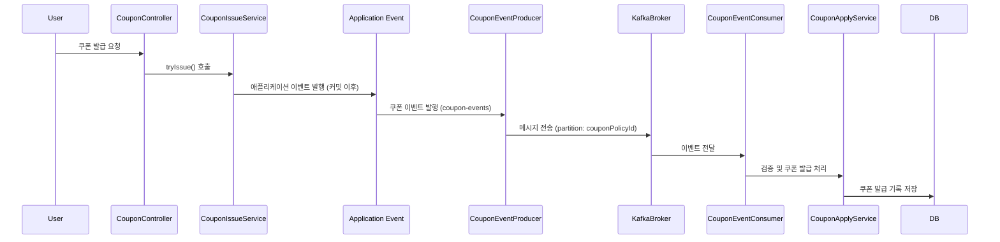

# 선착순 쿠폰 발급에 카프카(Kafka) 적용

기존 프로세스의 한계를 설명하고, 카프카를 활용한 방안을 제공합니다.


<br/>

## 📚 목차

- [1. 기존 프로세스 한계](#1-기존-프로세스-한계)
- [2. 개선 목표](#2-개선-목표)
- [3. Kafka 설계 전략](#3-Kafka-설계-전략)
- [4. Kafka 구성](#4-Kafka-구성)
- [5. 선착순 쿠폰 발급 시나리오](#5-선착순-쿠폰-발급-시나리오)
- [6. Kafka 기반 선착순 쿠폰 발급 예시](#6-Kafka-기반-선착순-쿠폰-발급-예시)
- [7. 개선 효과](#7-개선-효과)

<br/>

<br/>

## 1. 기존 프로세스 한계

- 동시성이 높은 상황에서 **DB 트랜잭션 기반 선착순 로직**은 경쟁이 발생하면 성능 저하 발생
- Redis나 DB에서 락을 걸어 처리하면 **대규모 요청 시 지연 발생**
- 주문/쿠폰 발급 이벤트가 다른 시스템으로 전달되기 어렵고, 확장성이 제한됨
- 중복 발급과 순서 보장 처리가 복잡

<br/>

<br/>

## 2. 개선 목표

- Kafka를 활용하여 **대용량 요청 처리**, **순서 보장 처리**를 효율적으로 구현
- 쿠폰 발급 로직과 이벤트 발행을 분리하여 **비동기 처리 및 MSA 확장성 확보**
- Consumer **병렬 확장**을 통해 **처리량 증가 및 장애 복원력 확보**

<br/>

<br/>


## 3. Kafka 설계 전략

### 3.1 메시지 기반 처리

- Service에서 **쿠폰 요청 이벤트 발행**
- Kafka Topic: `coupon-events`
- Partition Key: `couponPolicyId`
  → 같은 쿠폰 정책은 **같은 파티션**에 저장되어 순서 보장


### 3.2 Consumer 구조

- Consumer Group: `coupon-service-group`
- 각 Partition은 **하나 이상의 Consumer**가 담당 → 병렬 처리 가능
- Consumer에서 **중복 발급 체크 + 발급 가능 수량 확인 후 DB 업데이트**
- 필요 시 Redis를 활용해 **발급 가능 여부 캐싱 및 초기 필터링**

### 3.3 순차성 보장

- Partition Key를 쿠폰 정책 ID로 설정하여 동일 쿠폰 정책 이벤트는 같은 파티션으로 이동
- **단일 파티션 내 이벤트는 순차 처리** → 선착순 발급 가능

### 3.4 중복 처리 전략

1. DB 조회: 이미 발급된 유저인지 확인 (`existsByUserIdAndCouponPolicyId`)
2. 조건부 업데이트: 발급 수량 증가 시도 (`update issued_count where issued_count < total_quantity`)
3. Redis 캐시(Optional): 발급 가능 여부 선처리, 부하 감소
4. 발급 실패 시 이벤트 무시 및 로그 기록


<br/>

<br/>


## 4. Kafka 구성

구성 요소 | 역할
-- | --
Topic | coupon-events
Partition | 쿠폰 정책 ID 기준 파티셔닝 (순서 보장)
Producer | CouponService → CouponEventProducer
Consumer | CouponEventConsumer
Consumer Group | coupon-service-group (파티션 단위 병렬 처리)

<br/>

<br/>

## 5. **선착순 쿠폰 발급 시나리오**

### 5.1 시나리오 1️⃣: **Kafka + DB**

**흐름**

1. Producer가 모든 요청을 Kafka 토픽으로 발행
2. Consumer가 메시지를 처리하면서
    - **중복 발급 체크 (UNIQUE 제약 / PK 제약)**
    - **조건부 UPDATE**로 수량 차감 (`UPDATE ... WHERE issuedCount < totalQuantity`)

**장점**

- **구조 단순**: Redis 같은 외부 캐시 계층이 없어 관리 부담 ↓
- **정합성 보장**: DB 트랜잭션으로 발급 수량과 중복 발급을 동시에 제어 가능
- **운영 안정성**: 장애나 복구 시에도 DB 로그/스냅샷으로 복원 용이
- **명확한 구조**: 카프카 → DB → 최종 저장으로 프로세스가 명확

**단점**

- **DB 부하**: 대규모 트래픽 시 Consumer 인스턴스가 많아지면 DB에 쓰기 요청이 집중됨
- **성능 한계**: Redis 같은 메모리 기반 원자 연산보다 처리 속도 낮음
- **낙관적 락 경쟁**: 동시에 수많은 요청이 몰리면 `UPDATE WHERE issuedCount < totalQuantity` 경쟁으로 실패 재시도 증가

---

### 5.2 시나리오 2️⃣: **Kafka + DB + Redis**

**흐름**

1. **Redis에서 선착순 가능 여부 체크** (`DECR` 등)
2. Redis에서 가능하면 DB 트랜잭션 커밋 이후 Kafka 이벤트 발행
3. Consumer는 이벤트를 수신해 비즈니스 로직 처리
4. DB 업데이트 시 수량이 꽉 차 있으면 Redis를 "마감 상태"로 변경하는 이벤트 다시 발행

**장점**

- **성능 우수**: 대부분의 트래픽은 Redis에서 컷 → DB 부하 최소화
- **즉시성**: Redis 연산은 밀리초 단위로 빠름, 대규모 트래픽에 강함
- **확장성**: 병렬 Consumer 개수를 늘려도 Redis가 front 역할을 해주므로 안정적

**단점**

- **운영 복잡성**: Redis와 DB 간 데이터 불일치 가능 → 보정 로직 필요
- **복잡한 이벤트 플로우**: Redis 업데이트, DB 업데이트, Kafka 이벤트 발행이 얽혀 있어서 장애 복구 난이도 ↑
- **추가 비용**: Redis 인프라 운영 필요

<br/>

> **이번 주차는 Kafka를 통한 병렬성, 파티셔닝, 순차 보장 학습에 집중하고자 시나리오 1️⃣ (Kafka + DB) 형태로 구현하였습니다.**

<br/>

<br/>

## 6. **Kafka 기반 선착순 쿠폰 발급** 예시

### 6.1 Kafka Producer: 쿠폰 요청 발행

```java
@Service
@RequiredArgsConstructor
@Slf4j
public class CouponEventProducer {

    private final KafkaTemplate<String, String> kafkaTemplate;
    private final ObjectMapper objectMapper;

    private static final String TOPIC = "coupon-events";

    public void publish(CouponRequestedEvent event) {
        Long userId = event.userId();
        Long couponPolicyId = event.couponPolicyId();
        try {
            String message = objectMapper.writeValueAsString(event);
            kafkaTemplate.send(TOPIC, String.valueOf(couponPolicyId), message);
            log.info("쿠폰 요청 이벤트 발행 완료: {}", message);
        } catch (JsonProcessingException e) {
            log.error("쿠폰 이벤트 직렬화 실패, userId={}, couponId={}", userId, couponPolicyId, e);
        }
    }
}
```

- `couponPolicyId`를 **메시지 키로 지정** → 동일 쿠폰 정책 이벤트가 동일 파티션으로 들어가 순서 보장

- 직렬화/발행 과정에서 예외 캐치하고 로그 출력 → 안정성 고려

---

### 6.2 Kafka Consumer: 쿠폰 발급 처리

```java
@Service
@RequiredArgsConstructor
@Slf4j
public class CouponEventConsumer {

    private final CouponService couponService;
    private final ObjectMapper objectMapper;

    @KafkaListener(topics = "coupon-events", groupId = "coupon-service-group")
    public void consume(String message) {
        try {
            CouponRequestedEvent event = objectMapper.readValue(message, CouponRequestedEvent.class);
            Long userId = event.userId();
            Long couponPolicyId = event.couponPolicyId();

            // 중복 발급 + 수량 체크
            boolean granted = couponService.grantCouponIfNotExists(userId, couponPolicyId);
            if(granted) {
                log.info("쿠폰 발급 성공: userId={}, couponId={}", userId, couponPolicyId);
            } else {
                log.info("쿠폰 발급 실패: userId={}, couponId={}", userId, couponPolicyId);
            }

        } catch (Exception e) {
            log.error("쿠폰 이벤트 처리 실패, message={}", message, e);
        }
    }
}
```

- `couponService.grantCouponIfNotExists` 호출부와 로그 분기 (성공/실패) 명확
- 예외 처리 try-catch 블록으로 안정성 확보

---

### 6.3 CouponService: 중복 발급 + 수량 체크

```java
@Transactional
public boolean grantCouponIfNotExists(Long userId, Long couponPolicyId) {
    // 1. 이미 해당 유저가 이 쿠폰 정책으로 쿠폰을 발급받았는지 확인 (중복 발급 방지)
    boolean alreadyUsed = couponRepository.existsByUserIdAndCouponPolicyId(userId, couponPolicyId);
    if (alreadyUsed) return false; // 중복 발급

    // 2. 조건부 업데이트로 쿠폰 발급 수량 1 증가 시도
    int updatedRows = couponPolicyRepository.tryIncreaseIssuedCount(couponPolicyId);
    if (updatedRows == 0) return false; // 쿠폰 소진

    // 3. 쿠폰 생성 및 저장
    couponRepository.save(Coupon.create(userId, couponPolicyId, CouponStatus.ISSUED));
    return true;
}
```

- **중복 발급 방지:** `existsByUserIdAndCouponPolicyId` 먼저 확인 → 불필요한 DB write 줄임
- **조건부 업데이트로 수량 제어:** `increaseIssuedCount` (조건부 UPDATE) → 동시성 제어 핵심을 잘 반영
- **트랜잭션 단위 보장:** `@Transactional` 덕분에 중간 실패 시 롤백 가능
- DB **Unique Index** 추가 (`user_id + coupon_policy_id` 복합키)

---

### 6.4 시퀀스 다이어그램




<br/>

<br/>


## 7. 개선 효과

1. **대용량 처리**
    - Consumer 병렬 확장을 통해 요청 처리량 증가
    - Kafka 기반 비동기 처리로 Controller 응답 지연 최소화
2. **순서 보장**
    - Partition Key 기준 처리 → 선착순 발급 보장
3. **중복 처리**
    - DB 조건부 업데이트 + Redis 캐시(Optional) → 중복 발급 방지
4. **확장성**
    - Consumer 추가 → 트래픽 증가 대응
    - 다른 시스템에서도 동일 이벤트 구독 가능 (Analytics, Data Platform)
5. **시스템 복원력**
    - Kafka 내 메시지 로그 저장 → 장애 발생 시 재처리 가능