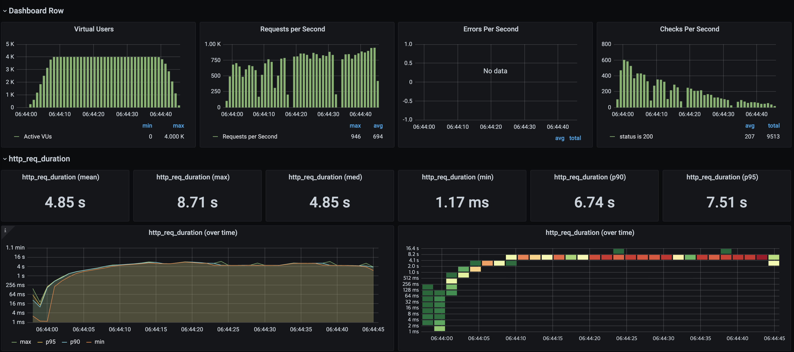
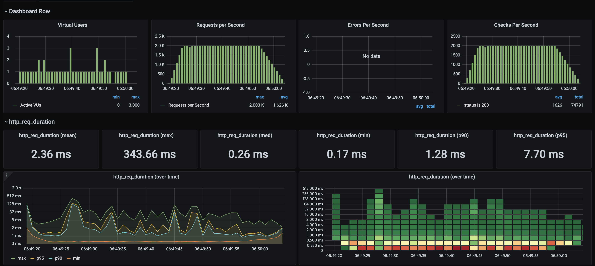

# 선착순 쿠폰 발급 시스템 성능 테스트 문서

부하 테스트 대상 선정 및 목적, 시나리오 등의 계획을 세우고, 테스트를 진행하며 획득한 다양한 성능 지표를 분석 및 시스템 내의 병목을 탐색 및 개선합니다.


<br/>

## 📚 목차

- [1. 목적](#1-목적)
- [2. 테스트 환경 구성](#2-테스트-환경-구성)
- [3. 테스트 시나리오 설계](#3-테스트-시나리오-설계)
- [4. 테스트 수행](#4-테스트-수행)
- [5. 테스트 수행 결과](#5-테스트-수행-결과)
- [6. 개선 및 결론](#6-개선-및-결론)

<br/>

<br/>

## 1. 목적

**선착순 쿠폰 발급**은 이벤트성 트래픽이 집중되는 특수한 시나리오이다. **선착순 쿠폰 발급 시스템**의 성능을 테스트하고, Redis 기반 처리에서 Kafka 기반 처리로 변경했을 때의 성능 차이를 비교한다.

- 목표: 실제 사용자 시나리오를 모사하여 **부하 테스트 수행 → 병목 지점 탐색 → 성능 개선안 도출**
- 평가 기준: 부하 테스트 설계 적절성, 성능 지표 분석, 개선

부하 테스트를 통해 두 시스템의 **처리량, 응답 속도, 실패율**을 비교하고, 두 방식의 장단점을 살펴본다.

<br/>

<br/>

## 2. 테스트 환경 구성

### 2.1 시스템 구성

- **쿠폰 발급 API**: `/coupons/issue`
- **Redis 기반 처리 환경**
    - 단일 Redis 서버에서 쿠폰 발급 및 재고 관리
    - 동시 요청 시 단일 Redis 서버에서 동기 처리
- **Kafka 기반 처리 환경**
    - 쿠폰 요청을 Kafka 토픽으로 발행
    - 컨슈머가 순차/병렬 처리하여 쿠폰 발급
- **부하 테스트 서버**
    - k6 실행: 로컬 환경, 최대 4,000 VU (Virtual User)
    - InfluxDB: 성능 지표 수집
    - Grafana: 결과 시각화

### 2.2 테스트 데이터

- 쿠폰 정책: 1개, 발급 수량 10,000개
- 유저: 10,000명 랜덤 분포
- 요청 유형: 선착순 쿠폰 발급

### 2.3 테스트 환경 세팅

[k6 + InfluxDB + Grafana로 테스트 환경 세팅하기](14_2_k6_load_testing_setup.md)

<br/>

<br/>


## 3. 테스트 시나리오 설계

### 3.1 부하 패턴

- **스파이크 부하(Spike)**: 짧은 시간에 폭발적 요청 집중
- **Ramping Arrival Rate** 시나리오:
    1. 워밍업: VU 점진적 증가 → 안정적 초기 환경 확보
    2. 스파이크 상승: PEAK_RPS까지 도달
    3. 피크 유지: 높은 TPS로 최대 부하 테스트
    4. 쿨다운: VU 감소 → 시스템 정상화 확인
- 목표:
    - 요청 처리 성공률 (status 200)
    - p95/p99 응답 지연
    - TPS(Throughput)
    - 오류율(issue_error_rate)

### 3.2 k6 스크립트 구조

- 사용자별 랜덤 ID 할당: **중복/경합 상황 재현**
- 요청마다 체크 수행:
    - HTTP status 200 확인
    - 지연 시간 수집(issue_latency)
    - 오류율 수집(issue_error_rate)
- Threshold 설정:
    - HTTP 실패율: 1% 이하
    - p95 응답 시간: 200ms 이하
    - 체크 성공률: 95% 이상

### 3.3 시나리오 예시

```jsx
scenarios: {
  spike_issue: {
    executor: 'ramping-arrival-rate',
    startRate: 0,
    preAllocatedVUs: 50,
    maxVUs: 2000,
    stages: [
      { target: 0, duration: '5s' },
      { target: 2000, duration: '5s' },
      { target: 2000, duration: '30s' },
      { target: 0, duration: '10s' },
    ],
    exec: 'issueCoupon',
  },
}
```

- 사용자당 요청 간 think time 최소화 → 실제 이벤트성 폭주 트래픽과 유사
- 실패율/지연 시간 지표 기록 → 병목 분석 가능

<br/>

<br/>

## 4. 테스트 수행

### 4.1 k6 스크립트 (주요 내용)

```jsx
import http from 'k6/http';
import { check } from 'k6';
import { Trend, Rate } from 'k6/metrics';

export const issueLatency = new Trend('issue_latency', true);
export const issueErrorRate = new Rate('issue_error_rate');

export const options = {
    scenarios: {
        spike_issue: {
            executor: 'ramping-arrival-rate',
            startRate: 0,
            timeUnit: '1s',
            preAllocatedVUs: 50,
            maxVUs: 2000,
            stages: [
                { target: 0, duration: '5s' },
                { target: 2000, duration: '5s' },
                { target: 2000, duration: '30s' },
                { target: 0, duration: '10s' },
            ],
            exec: 'issueCoupon',
        },
    },
};

export function issueCoupon() {
    const userId = Math.floor(Math.random() * 10000) + 1;
    const res = http.post('http://localhost:8080/coupons/issue', JSON.stringify({ userId, couponPolicyId: 1 }), {
        headers: { 'Content-Type': 'application/json' },
    });
    const ok = check(res, { 'status is 200': (r) => r.status === 200 });
    issueLatency.add(res.timings.duration);
    issueErrorRate.add(!ok);
}

```

### 4.2 결과 수집

- **InfluxDB**: k6 결과 시계열 저장
- **Grafana**: 응답 시간, TPS, 실패율 시각화

<br/>

<br/>

## 5. 테스트 수행 결과

### 5.1 Redis 기반



지표 | 값
-- | --
성공률(checks) | 29.79%
p95 응답 시간 | 7.5s
실패율(http_req_failed) | 70.20%
TPS | 612/s
평균 지연(issue_latency) | 4.85s
최대 지연 | 8.71s

- 분석: Redis는 메모리 기반 처리지만, **VU 최대치 도달 시 동시 요청 처리 한계로 실패율 급증**
- 병목: 단일 서버 Redis, 발급 로직 동기 처리

---

### 5.2 Kafka 기반




지표 | 값
-- | --
성공률(checks) | 100%
p95 응답 시간 | 7.84ms
실패율(http_req_failed) | 0%
TPS | 1,498/s
평균 지연(issue_latency) | 2.37ms
최대 지연 | 343.66ms

- 분석: Kafka 기반 비동기 처리로 **모든 요청 성공, 지연 최소화**
- 병목 없음, 컨슈머 병렬 처리로 고부하 처리 가능

---

### 5.3 Redis vs Kafka 비교

항목 | Redis | Kafka
-- | -- | --
성공률 | 29.79% | 100%
p95 | 7.5s | 7.84ms
실패율 | 70.20% | 0%
TPS | 612/s | 1,498/s
평균 지연 | 4.85s | 2.37ms

- Redis는 단순하고 빠르지만 동시 요청 폭주 시 실패율 급증
- Kafka는 비동기 메시징 처리로 안정적, 높은 TPS와 낮은 지연 확보


<br/>

<br/>

## 6. 개선 및 결론

1. **Redis 처리**
    - 장점: 단순, 메모리 기반 빠른 처리
    - 단점: 고부하 동시 요청 시 실패율 증가 → Redis 클러스터 구성 필요
2. **Kafka 처리**
    - 장점: 비동기 처리 → 높은 성공률, 낮은 지연, TPS 개선
    - 단점: 초기 컨슈머 설정 및 VU 제한 고려 필요
    - 개선: 컨슈머 병렬 처리 수 늘리기, VU 증가 시 메시지 소비 속도 최적화
3. **결론**
    - 선착순 쿠폰 발급처럼 **단기 폭발 트래픽 처리에는 Kafka 기반 비동기 처리**가 효과적
    - Redis는 소규모 트래픽이나 캐싱 용도로 유지 가능